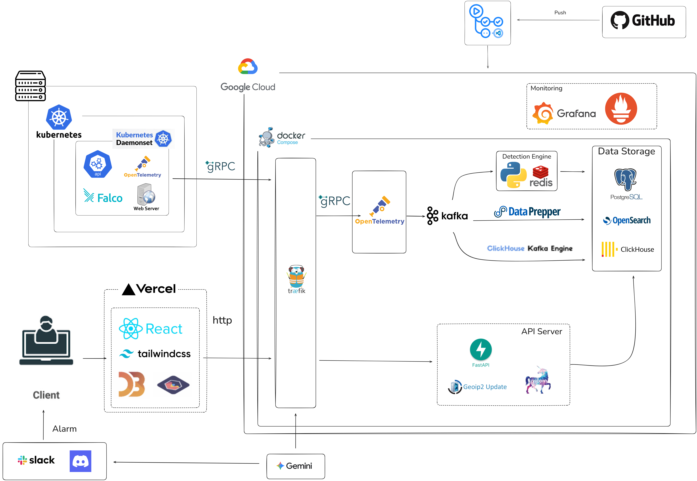
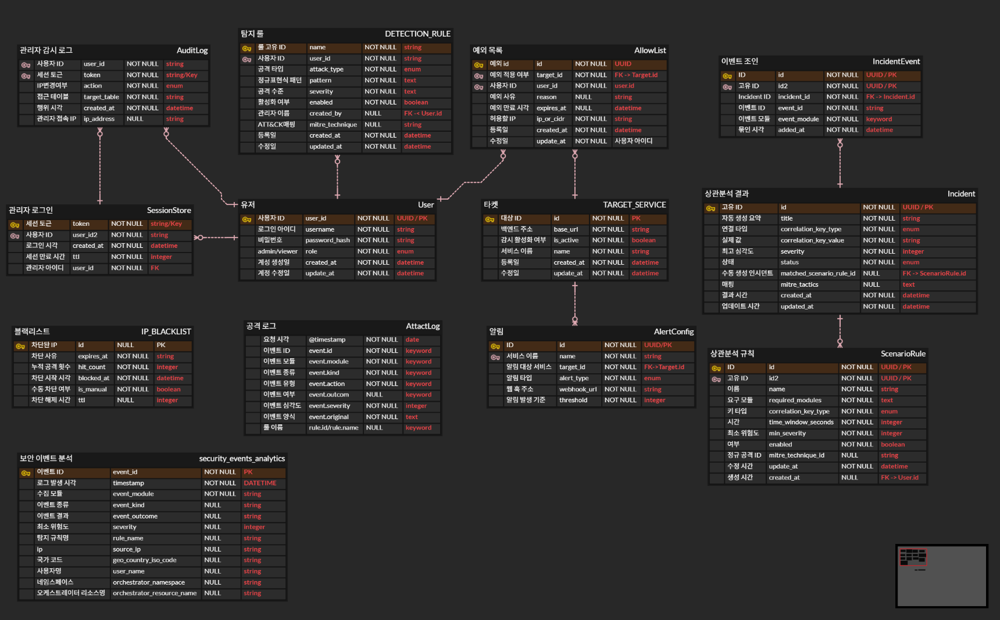

<!--
Organization Profile README
경로: 2026-Techeer-Summer-BootCamp-Team-B/.github/profile/README.md

권장 이미지 경로: .github/profile/assets/
logo.png, hero.gif, demo.gif, architecture.png, erd.png,
overview.png, incident.png, infrastructure.png, admin.png,
waf.png, was.png, falco.png, k8s-audit.png
-->

<div align="center">

<!-- 로고가 준비되면 주석을 해제하세요.

-->

# SENTINEL-OPS

### 흩어진 보안 로그를 연결된 하나의 공격 시나리오로 재구성하는 실시간 SIEM 플랫폼

WAS · WAF · Falco · Kubernetes Audit 로그를 실시간으로 수집하고,<br/>
시간 · IP · 계정 · 리소스 기반 상관분석으로 위협을 조기에 탐지합니다.

<br/>

[](#-tech-stack)
[](#-tech-stack)
[](#-tech-stack)
[](#-tech-stack)
[](#-tech-stack)
[](#-tech-stack)

<br/>

[**Central SIEM 저장소**](https://github.com/2026-Techeer-Summer-BootCamp-Team-B/IDS-COLLECTOR) ·
[**Target 서버 저장소**](https://github.com/2026-Techeer-Summer-BootCamp-Team-B/Techeer-12th-b)

</div>

---

## 📌 프로젝트 소개

컨테이너 환경에서 하나의 공격은 여러 계층에 나뉜 흔적으로 남습니다.

- **WAF**에는 SQL Injection, XSS, Bad Bot과 같은 악성 요청이 남습니다.
- **WAS**에는 정찰성 요청과 비정상적인 엔드포인트 접근 기록이 남습니다.
- **Falco**에는 컨테이너 내부의 셸 실행, 민감 파일 접근, 권한 상승 행위가 남습니다.
- **Kubernetes Audit**에는 RBAC 변경, ServiceAccount 오용, 비정상 API 호출이 남습니다.

개별 로그만 보면 서로 관계없는 이벤트처럼 보일 수 있습니다. **SENTINEL-OPS**는 이 이벤트들을 OpenTelemetry 기반 파이프라인으로 수집·정규화하고, `시간 · IP · 계정 · 리소스` 관계를 분석하여 **하나의 연결된 인시던트**로 재구성합니다.


---

## 🎬 Demo

<div align="center">


</div>
<div align="center">

<!-- hero.gif 업로드 후 사용하세요. -->


---
</div>


### 문제와 해결 방식

| 기존 문제 | SENTINEL-OPS의 해결 방식 |
| --- | --- |
| 보안 이벤트가 애플리케이션·컨테이너·클러스터 계층에 분산됨 | WAS·WAF·Falco·K8s Audit 이벤트를 공통 스키마로 통합 |
| 단일 이벤트만으로 전체 공격 흐름을 파악하기 어려움 | Threshold·Sequence 기반 상관분석으로 연관 이벤트를 인시던트로 병합 |
| 탐지 이후 분석과 대응이 수작업으로 진행됨 | MITRE ATT&CK 태깅, AI 리포트, Slack·Discord 알림 제공 |
| 로그 검색·대량 분석·운영 데이터의 저장 요구가 서로 다름 | PostgreSQL·OpenSearch·ClickHouse·Redis를 역할별로 분리 |

---

## ✨ 핵심 기능

<table>
<tr>
<td width="50%" valign="top">

### 🔭 다계층 로그 통합 수집

- WAS 액세스 로그
- 자체 개발 FastAPI WAF 탐지 로그
- Falco 런타임 보안 이벤트
- Kubernetes Audit 로그
- OpenTelemetry OTLP 기반 실시간 전달

</td>
<td width="50%" valign="top">

### 🧩 시나리오 상관분석

- Threshold·Sequence 룰 지원
- 32종 시나리오 룰 평가
- 이벤트 자동 생성·병합
- MITRE ATT&CK 전술·기법 태깅
- 시간·IP·계정·리소스 기반 관계 분석

</td>
</tr>
<tr>
<td width="50%" valign="top">

### 📊 실시간 보안 대시보드

- 보안 KPI와 로그 추이
- GeoIP 기반 공격 발원지 지도
- 인시던트 공격 스토리라인
- 실시간 이벤트 및 Activity Flow
- DQL 기반 로그 검색
- 드래그 앤 드롭 커스텀 위젯

</td>
<td width="50%" valign="top">

### 🚨 인시던트 운영 및 대응

- `open → investigating → closed` 상태 관리
- True Positive / False Positive 판정
- IP 차단·해제 및 감사 이력
- Critical 등급 실시간 알림
- PDF·CSV 인시던트 리포트

</td>
</tr>
<tr>
<td width="50%" valign="top">

### 🤖 AI 보안 리포트

- Gemini 기반 탐지 트렌드 요약
- 공격 흐름과 예상 영향 설명
- 권장 대응 조치 생성
- 일간·주간 보안 리포트
- Slack·Discord 연동

</td>
<td width="50%" valign="top">

### 🛡️ Target 보안 노드

- Juice Shop 기반 공격 대상 환경
- Detection / Prevention WAF 모드
- SQLi·XSS·Command Injection·Path Traversal 탐지
- Bad Bot·Rate Limiting·Brute Force·CORS 위반 탐지
- Falco·K8s Audit·WAS 로그 중앙 전송

</td>
</tr>
</table>


---

## 🔄 End-to-End Security Flow

```text
┌──────────────────── Target Security Node ────────────────────┐
│                                                              │
│ Browser                                                      │
│   ├──▶ FastAPI WAF ───────────────▶ WAF Detection Log      │
│   └──▶ Nginx + Juice Shop ─────────▶ WAS Access Log        │
│                                                              │
│ Falco DaemonSet ───────────────────▶ Runtime Security Log   │
│ Kubernetes API Server ─────────────▶ Audit Log              │
│                                                              │
└──────────────────────────────┬───────────────────────────────┘
                               │ OTLP(gRPC/HTTP)
                               ▼
┌──────────────────────── Central SIEM ────────────────────────┐
│ OpenTelemetry Collector                                      │
│          │                                                   │
│          ▼                                                   │
│ Kafka Source Topics                                          │
│          │                                                   │
│          ▼                                                   │
│ Normalizer                                                   │
│ Dedupe → Parsing → ECS Normalization → GeoIP Enrichment      │
│          │                                                   │
│          ▼                                                   │
│ events.normalized                                            │
│    ┌───────────────┬─────────────────┬─────────────────┐     │
│    ▼               ▼                 ▼                 │     │
│ Correlation     OpenSearch        ClickHouse           │     │
│ Engine          Search/Forensic   Analytics            │     │
│    │                                                         │
│    ▼                                                         │
│ PostgreSQL Incident + MITRE ATT&CK Tagging                   │
│    │                                                         │
│    ├──▶ React Dashboard                                     │
│    ├──▶ AI Security Report                                  │
│    └──▶ Slack / Discord Alert                               │
└──────────────────────────────────────────────────────────────┘
```

### 공격 탐지 예시

```text
1. WAF       : SQL Injection 페이로드 탐지
2. WAS       : 동일 IP의 반복적인 인증 우회 요청 기록
3. Falco     : 컨테이너 내부 비정상 셸 실행 탐지
4. K8s Audit : ServiceAccount 권한 변경 시도 기록
5. SIEM      : 시간·IP·리소스 관계를 분석해 하나의 Critical 인시던트로 병합
6. Response  : 대시보드 표시 + AI 분석 + Slack 긴급 알림
```

---

## 🖥️ 주요 화면

### Overview

전체 로그 수, 위험도, 활성 탐지 소스, 공격 발원지, 최근 이벤트와 상관 흐름을 한 화면에서 확인합니다.

<div align="center">

</div>

<br/>

### Incident

연관 이벤트를 시간순 공격 스토리라인으로 확인하고, MITRE ATT&CK 태그·상태·정오답 판정을 관리합니다.

<div align="center">

</div>

<br/>

### Infrastructure

Kubernetes 클러스터 구조와 Kafka Consumer Lag, DLQ, 수집 지연 등 전체 보안 파이프라인의 상태를 확인합니다.

<div align="center">

</div>

<br/>

### Admin

사용자·보호 대상·예외 IP·시나리오 룰·알림 등급·보존 정책을 통합 관리합니다.

<div align="center">

</div>

<details>
<summary><b>WAF / WAS / Falco / K8s Audit 상세 화면</b></summary>
<br/>

| 화면 | 주요 정보 |
| --- | --- |
| **WAF** | 공격 유형, 위험도, 탐지·차단 여부, 매칭 규칙 |
| **WAS** | 응답 상태, 엔드포인트 트래픽, p50·p90·p99 지연시간 |
| **Falco** | 룰 이름, 프로세스, 컨테이너·Pod·Namespace 컨텍스트 |
| **K8s Audit** | Verb, 리소스, RBAC 변경, 사용자·ServiceAccount |

<p align="center">


</p>
<p align="center">


</p>

</details>

---

## 🏗️ System Architecture

<div align="center">

</div>

1. **Detect & Collect** — Target 서버에서 WAF·WAS·Falco·K8s Audit 이벤트를 생성하고 OTel Collector로 수집합니다.
2. **Transfer** — Target Collector가 이벤트에 `log.source`를 부여하고 Central SIEM으로 OTLP 전송합니다.
3. **Normalize** — 중복 제거, 소스별 파싱, ECS 정규화, GeoIP·Kubernetes 메타데이터 보강을 수행합니다.
4. **Correlate** — Threshold·Sequence 시나리오를 평가해 연관 이벤트를 하나의 인시던트로 병합합니다.
5. **Store & Analyze** — PostgreSQL은 운영 데이터, OpenSearch는 검색·포렌식, ClickHouse는 대량 분석, Redis는 상태·세션을 담당합니다.
6. **Visualize & Notify** — FastAPI와 React 대시보드가 결과를 제공하고 AI 리포트 및 Slack·Discord 알림을 전송합니다.

---

## 🗃️ Data Architecture

<div align="center">

</div>

| 저장소 | 역할 |
| --- | --- |
| **PostgreSQL 16** | 사용자, 보호 대상, 시나리오 룰, 인시던트, 차단·감사 이력 |
| **OpenSearch 2.19** | 정규화 이벤트 검색·집계 및 원본 포렌식 |
| **ClickHouse 26.4** | 대량 로그 컬럼형 분석과 Top-N 집계 |
| **Redis 7** | 중복 제거, 상관분석 윈도우·쿨다운, 로그인 세션 |

<details>
<summary><b>PostgreSQL 주요 테이블</b></summary>
<br/>

| 테이블 | 역할 |
| --- | --- |
| `users` | 관리자·조회자 계정 및 권한 |
| `targets` | 보호 대상 애플리케이션 |
| `allow_list` | 전역 또는 Target 단위 예외 IP |
| `scenario_rules` | 상관분석 시나리오 룰 |
| `incidents` | 보안 사고 상태·등급·판정 정보 |
| `incident_events` | 인시던트와 원본 이벤트 매핑 |
| `banned_ips` | IP 차단·해제 이력 |
| `audit_logs` | 관리자 행위 감사 로그 |
| `alert_configs` | Slack·Discord 알림 설정 |
| `log_policies` | 로그 등급별 보존 정책 |
| `ai_trend_report_cache` | AI 트렌드 리포트 캐시 |

</details>

---

## 🧰 Tech Stack

### Frontend

<p>


</p>

### Backend & Streaming

<p>


</p>

### Database & Search

<p>


</p>

### Infrastructure & Security

<p>


</p>

### Monitoring / Observability

<p>
  
  
  
  
</p>

### ETC

<p>


</p>

## 📦 Repositories

<table>
<tr>
<td width="50%" valign="top">

### [IDS-COLLECTOR](https://github.com/2026-Techeer-Summer-BootCamp-Team-B/IDS-COLLECTOR)

**Central SIEM · Main Monorepo**

다계층 로그 수집 게이트웨이, Kafka 스트리밍, 정규화, 시나리오 상관분석, 인시던트 관리, FastAPI API, React 대시보드, AI 리포트와 저장 계층을 포함합니다.

`React` `FastAPI` `Kafka` `OpenSearch` `ClickHouse` `PostgreSQL` `Redis`

</td>
<td width="50%" valign="top">

### [Techeer-12th-b](https://github.com/2026-Techeer-Summer-BootCamp-Team-B/Techeer-12th-b)

**Target Security Node**

OWASP Juice Shop을 보호 대상으로 구성하고, 자체 FastAPI WAF·WAS·Falco·K8s Audit 로그를 생성·수집하여 Central SIEM으로 OTLP 전송합니다.

`FastAPI WAF` `OWASP Juice Shop` `Falco` `K8s Audit` `OpenTelemetry` `k3d`

</td>
</tr>
</table>

> 각 저장소의 설치 방법, 환경 변수, 디렉터리 구조와 세부 구현은 해당 저장소의 README에서 관리합니다. 이 Organization README는 전체 프로젝트의 목적과 두 저장소의 관계를 설명하는 통합 소개 페이지입니다.

---

## 👥 Team B

<!-- 실제 GitHub ID와 담당 영역을 최종 확인해 수정하세요. -->

| 이름 | 역할 | 주요 담당 영역 |
| --- | --- | --- | 
| 이용욱 | 팀장 | |
| 심다움 | 팀원 | |
| 하지환 | 팀원 | |
| 윤재영 | 팀원 | |
| 서동영 | 팀원 | |


---

## 📚 Documentation

- [Central SIEM README](https://github.com/2026-Techeer-Summer-BootCamp-Team-B/IDS-COLLECTOR#readme)
- [Target Security Node README](https://github.com/2026-Techeer-Summer-BootCamp-Team-B/Techeer-12th-b#readme)
- [Backend Engineering Notes](https://github.com/2026-Techeer-Summer-BootCamp-Team-B/IDS-COLLECTOR/blob/main/docs/BACKEND_ENGINEERING_NOTES.md)

---

<div align="center">

### From fragmented security logs to one connected incident.

**SENTINEL-OPS · 2026 Techeer Summer Bootcamp Team B**

</div>
